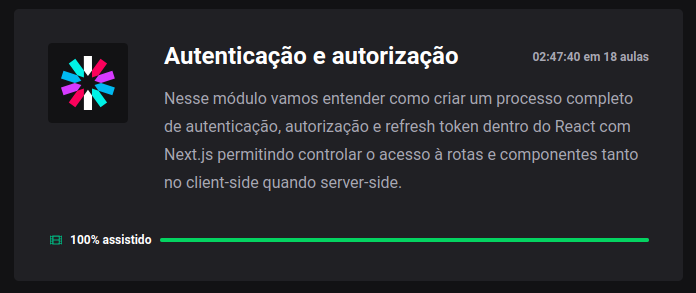

<h1 align="center">
  💻 Ignite - Autenticação e Autorização
</h1>

<h4 align="center"><a href="https://www.rocketseat.com.br/ignite">Clique para visitar o curso</a></h4>

## 📚 Descrição

Este projeto foi criado com o intuito de fornecer uma compreensão aprofundada sobre a implementação de um processo completo de autenticação, autorização e atualização de token no ambiente React utilizando Next.js. Através desse projeto, é possível ter controle preciso sobre o acesso a rotas e componentes, tanto no lado do cliente como no lado do servidor.

---

## 💼 Tecnologias utilizadas

Para o desenvolvimento deste site utilizei as seguintes tecnologias:

- HTML;
- CSS;
- Typescript;
- React;
- Next.js;

---

<h2>Autor</h2>

<table>
  <tr>
    <td align="center">
      <a href="https://github.com/daniel-soaress">
         
        
          <b>Daniel Soares</b>
        
      </a>
    </td>
  </tr>
</table>
